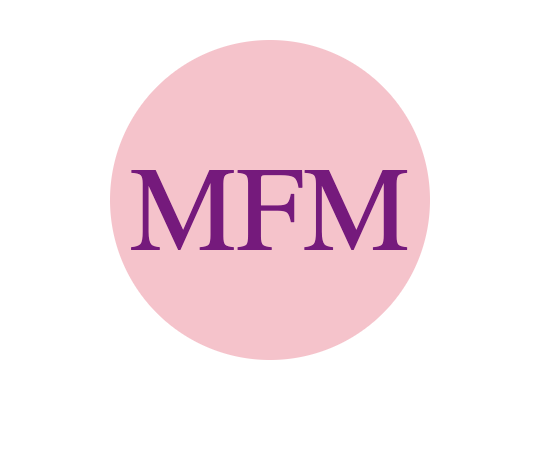
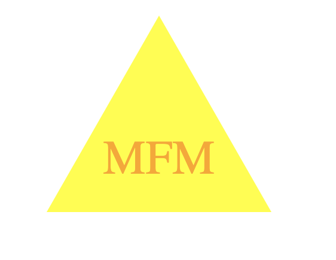
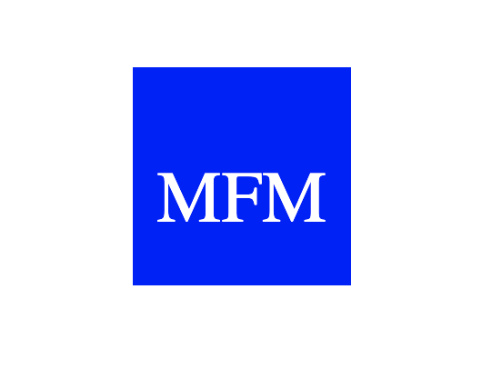

# 10 Object-oriented Programming: SVG Logo Maker

## Task

Given no starter code, the task for this Challenge was to create a logo maker with 4 important imput from the user: text, shape, text color and shape color. Receiving this information through the command-line, the application creates a SVG file with the specifications provided by the user. 

This applications is not deployed. At the end of this file you can find a demo GIF showing the functionality of the app.

### Given User Story

```md
AS a freelance web developer
I WANT to generate a simple logo for my projects
SO THAT I don't have to pay a graphic designer
```

## Mock-Up

The following images shows examples of SVG files created with the application.







## Demo GIF


---
© 2023 edX Boot Camps LLC. Confidential and Proprietary. All Rights Reserved.
